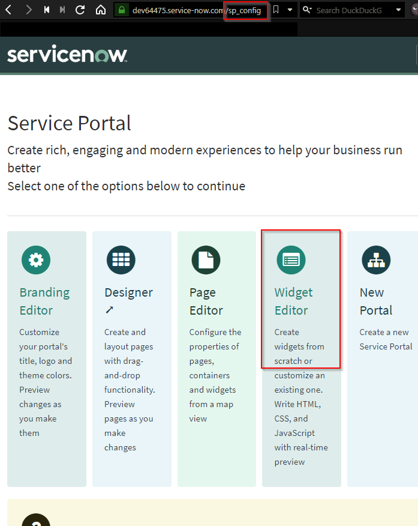

# How to create your own ServiceNow widget

---

<!-- paginate: true -->

### Smells like presentations agenda

- [How to create your own ServiceNow widget](#how-to-create-your-own-servicenow-widget)
    - [Smells like presentations agenda](#smells-like-presentations-agenda)
  - [Fantastic widgets and where to find them](#fantastic-widgets-and-where-to-find-them)
      - [Widget Editor](#widget-editor)
  - [Much to learn, you still have](#much-to-learn-you-still-have)
    - [Basics](#basics)
    - [Understanding of global objects in widget](#understanding-of-global-objects-in-widget)
    - [Together we can ~~rule~~ create a widget](#together-we-can-srules-create-a-widget)
  - [Hello world](#hello-world)
  - [Update a record](#update-a-record)
  - [Validate record at front end](#validate-record-at-front-end)
  - [Angular directives](#angular-directives)
  - [Useful links](#useful-links)

---

<!-- _class: invert -->
## Fantastic widgets and where to find them

---

#### Widget Editor


There are two options to get your way to the inside of a widget.
Within the backend just search for "widget" and you will find it under
Service Portal > Widgets

---



You can also find the editor with the URL:

<your_servicenow_instance>**/sp_config**

---

<!-- _class: invert -->
## Much to learn, you still have

> Fear is the path to the dark side. Fear leads to anger. Anger leads to hate. 
> Hate leads to very miserable widgets.
>
> *Senior ServiceNow Developer Y. Oda*

---

### Basics

Prerequisite to work with widgets:
- how to query data from the server
- how to manipulate data and save it
- common understandig of AngularJS
  - bind variables to client controllers
  - access server object in a widget
  - gather user input

---

### Understanding of global objects in widget


---

### Together we can ~~rule~~ create a widget

**Demo**

---

## Hello world

HTML | Client | Server
---|---|---
```html
<h1></h1>
```


---

## Update a record

---

## Validate record at front end

---

## Angular directives

---

## Useful links

[Widget guide](https://docs.servicenow.com/bundle/orlando-servicenow-platform/page/build/service-portal/concept/widget-dev-guide.html)